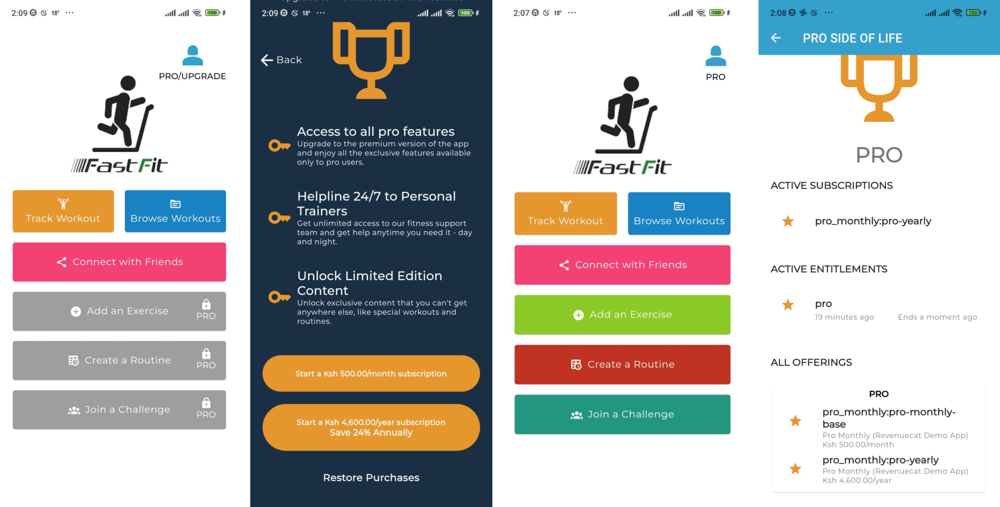

# revenuecat_demo

A Flutter Demo App Showcasing Revenuecat integration, Riverpod, and Google Play.

Direct to the point, without the bullsh*t.

## Getting Started

This project is a starting point for a Flutter application.

A few resources to get you started if this is your first Flutter project:

- [Lab: Write your first Flutter app](https://docs.flutter.dev/get-started/codelab)
- [Cookbook: Useful Flutter samples](https://docs.flutter.dev/cookbook)

For help getting started with Flutter development, view the
[online documentation](https://docs.flutter.dev/), which offers tutorials,
samples, guidance on mobile development, and a full API reference.

> NB: Copy the `.env.example` file to `.env` and provide the requried keys

## Google play subscriptions
For the subscriptions to work, ensure your app is released to 'Closed Testing'. Otherwise, you won't be able to view the products from Google Play. Make sure you release to the **closed testing**.

- The name of the entire subscription is equivalent to `subscription groups` in IOS. So name it `Pro`. It is the Product ID` in Revenuecat.
- The base plans now can be customizable to, say: `pro-monthly`, `pro-yearly`. Also, you can make it country-wise e.g. `pro-monthly-emea`, `pro-mothly-south-america`, e.t.c.

[Revenuecat Docs](https://www.revenuecat.com/docs/getting-started#4-using-revenuecats-purchases-sdk)

